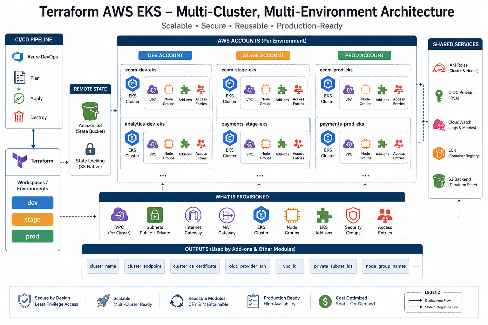

# 🚀 Production-Ready Multi-Cluster EKS Provisioning with Terraform

---

## 🧠 Overview

This repository provisions **Amazon EKS clusters using Terraform** in a **production-grade, reusable, and scalable architecture**.

It supports:

* 🌍 **Multi-environment setup** (dev, stage, prod)
* 🧩 **Multiple clusters per environment**
* 🏗️ **Dedicated VPC per cluster**
* 🔐 **Fine-grained access control (EKS Access Entries)**
* ⚙️ **Reusable Terraform modules**
* 📦 **EKS managed add-ons (CNI, CoreDNS, kube-proxy)**
* 🔁 **CI/CD integration via Azure DevOps**

---

## 🏗️ Architecture

<p align="center">
  
</p>

```text
Azure DevOps Pipeline
        ↓
Terraform (envs/dev | stage | prod)
        ↓
Reusable Module (eks-cluster)
        ↓
AWS Resources Created:
  ├── VPC (per cluster)
  ├── Subnets (public + private)
  ├── NAT Gateway
  ├── EKS Cluster
  ├── Node Groups (on-demand + spot)
  ├── IAM Roles (Cluster + Nodes)
  ├── OIDC Provider (IRSA)
  ├── EKS Add-ons
  └── Access Entries (RBAC)
```

---

## 📂 Repository Structure

```text
tf-aws-eks/
├── envs/
│   ├── dev/
│   ├── stage/
│   └── prod/
│
├── modules/
│   └── eks-cluster/
│       ├── vpc.tf
│       ├── eks.tf
│       ├── node-groups.tf
│       ├── addons.tf
│       ├── access-entries.tf
│       ├── outputs.tf
│       └── variables.tf
│
├── azure-pipelines.yaml
└── .gitignore
```

---

## ⚙️ Key Features

### 🧩 Multi-Cluster Design

Each environment can define multiple clusters:

```hcl
clusters = {
  ecom = {}
  payments = {}
}
```

Each cluster gets:

```text
✔ Dedicated VPC
✔ Isolated networking
✔ Independent scaling
```

---

### 🌍 Multi-Environment Support

```text
dev   → AWS Dev Account
stage → AWS Stage Account
prod  → AWS Prod Account
```

Each environment:

* Uses separate AWS credentials
* Has isolated Terraform state
* Can be deployed independently

---

### 🔐 Access Control (EKS Access Entries)

Cluster-level access is fully configurable:

```hcl
access_entries = {
  admin = {
    principal_arn = "arn:aws:iam::xxx:user/admin"
    policy_arn    = "AmazonEKSClusterAdminPolicy"
  }
}
```

Supports:

```text
✔ CI/CD access
✔ Admin users
✔ Read-only roles
✔ Per-cluster RBAC
```

---

### ⚙️ Node Groups (Production Ready)

Supports multiple node groups per cluster:

```hcl
node_groups = {
  general = {}
  spot    = {}
}
```

Features:

```text
✔ ON_DEMAND & SPOT support
✔ Autoscaling
✔ Labels for workload separation
✔ Rolling updates
```

---

### 📦 EKS Add-ons

Managed add-ons included:

```text
✔ vpc-cni
✔ coredns
✔ kube-proxy
```

Configurable per cluster.

---

### 🔐 Secure State Management

```text
✔ Remote state in S3 (per environment)
✔ Native S3 locking (use_lockfile)
✔ No local state leakage
```

---

### 🔁 CI/CD Integration

Azure DevOps pipeline supports:

```text
✔ Plan / Apply / Destroy
✔ Environment-based execution
✔ Multi-account deployments
✔ Manual approval for production
```

---

## 🚀 How to Use

### 1️⃣ Configure Environment

```bash
cd envs/dev
```

Edit:

```text
terraform.tfvars
```

---

### 2️⃣ Initialize Terraform

```bash
terraform init
```

---

### 3️⃣ Plan

```bash
terraform plan
```

---

### 4️⃣ Apply

```bash
terraform apply
```

---

## 🔁 Pipeline Usage

Run pipeline with:

```text
Environment: dev | stage | prod
Action: plan | apply | destroy
```

---

## 📤 Outputs

This module exposes outputs required for downstream add-ons:

```text
✔ cluster_name
✔ cluster_endpoint
✔ cluster_ca_certificate
✔ oidc_provider_arn
✔ subnet_ids
✔ vpc_id
```

👉 Used by: **tf-eks-cluster-addons repo**

---

## 🧠 Design Principles

```text
✔ Reusability → modules
✔ Scalability → multi-cluster
✔ Isolation → per VPC + per account
✔ Security → IAM + access entries
✔ Automation → CI/CD driven
```

---

## 🔥 Real-World Use Cases

```text
✔ Microservices architecture (multiple clusters)
✔ Multi-tenant platforms
✔ Environment isolation (dev/stage/prod)
✔ Enterprise Kubernetes deployments
```